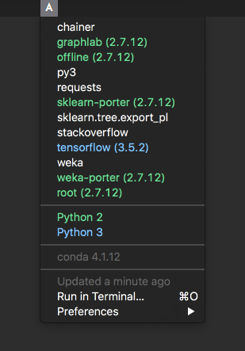

# conda-envs

[BitBar](https://getbitbar.com/) plugin to list all created [conda](https://www.continuum.io/downloads) environments and to open a new session with a chosen environment.

## Screenshot

## License

The library is Open Source Software released under the [MIT](license.txt) license.